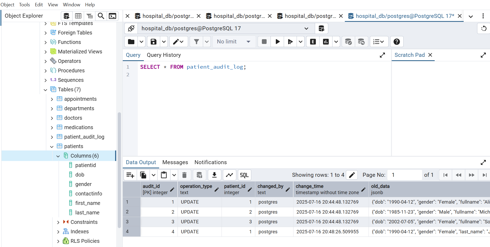

# HospitalManagementDB
SQL-based Hospital Management System with ERD, procedures, sample data and queries

## 🔐 Backup & Restore (Disaster Recovery)

This project includes real PostgreSQL backup and restore operations using `pg_dump` and `pg_restore`.

### 💾 Backup File Example


### 🛠️ Backup Commands

```bash
pg_dump -U postgres -d hospital_db -F c -f hospital_db.backup
pg_restore -U postgres -d hospital_db hospital_db.backup


## 🔍 Change Audit Logging

All changes to the `patients` table are automatically logged via a PostgreSQL `AFTER` trigger.

### 💡 Features:
- Tracks `INSERT`, `UPDATE`, and `DELETE` operations
- Stores full `old_data` and `new_data` in JSON format
- Records the `user` who made the change

### 📸 Audit Log Example



### 🔧 Sample Trigger Logic (PL/pgSQL)

```sql
IF TG_OP = 'UPDATE' THEN
  INSERT INTO patient_audit_log(
    operation_type, patient_id, changed_by, old_data, new_data
  )
  VALUES ('UPDATE', NEW.patientid, current_user, to_jsonb(OLD), to_jsonb(NEW));
