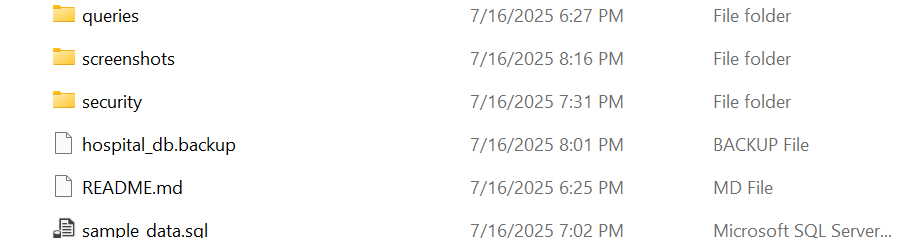

# HospitalManagementDB
SQL-based Hospital Management System with ERD, procedures, sample data and queries

## 🔐 Backup & Restore (Disaster Recovery)

This project includes real PostgreSQL backup and restore operations using `pg_dump` and `pg_restore`.

### 💾 Backup File Example



### 🛠️ Backup Commands

```bash
pg_dump -U postgres -d hospital_db -F c -f hospital_db.backup
pg_restore -U postgres -d hospital_db hospital_db.backup
